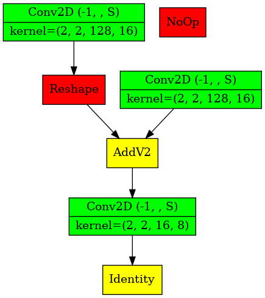
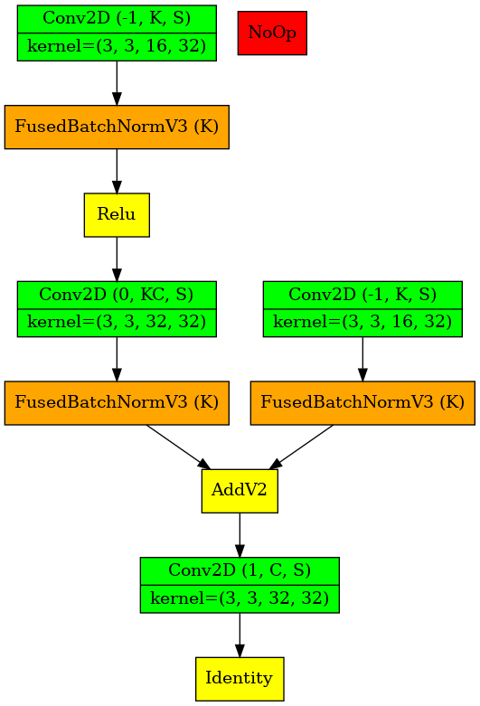
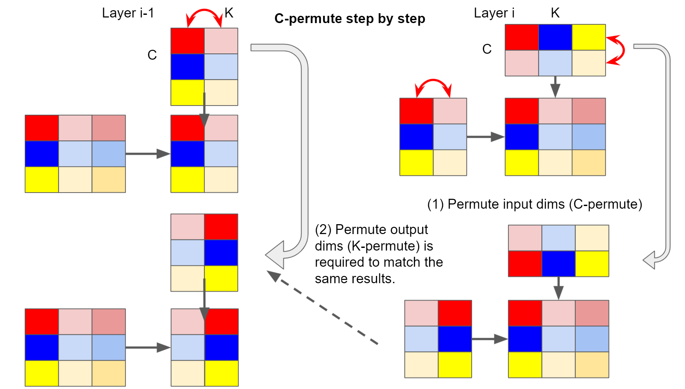
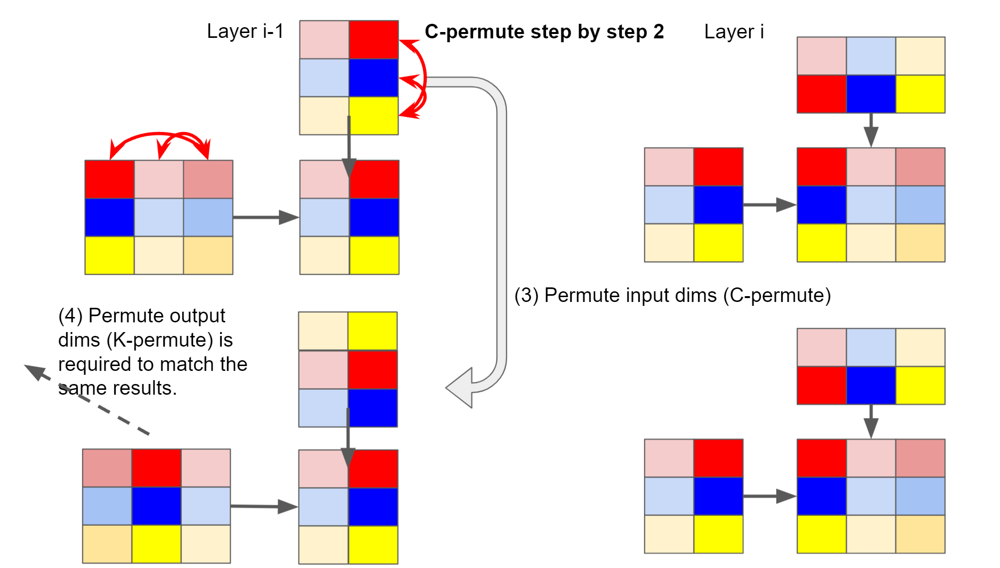
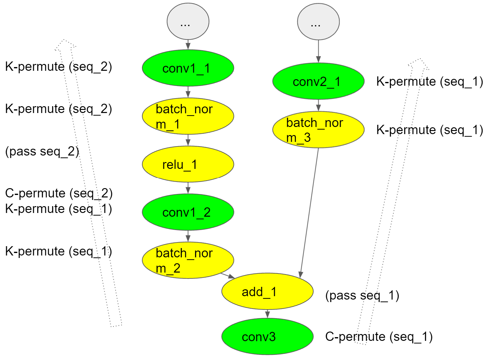
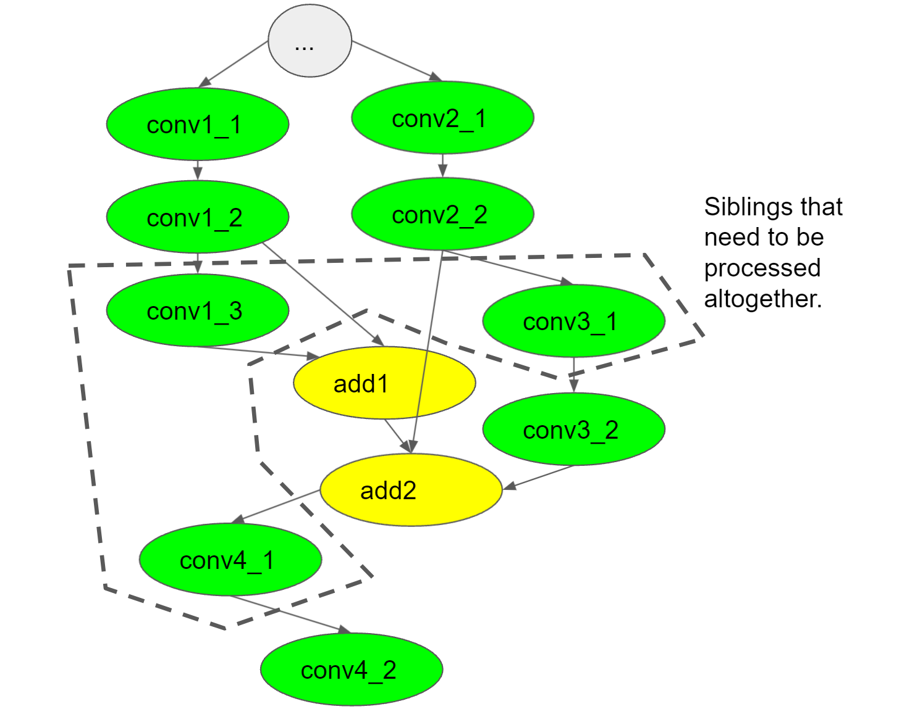
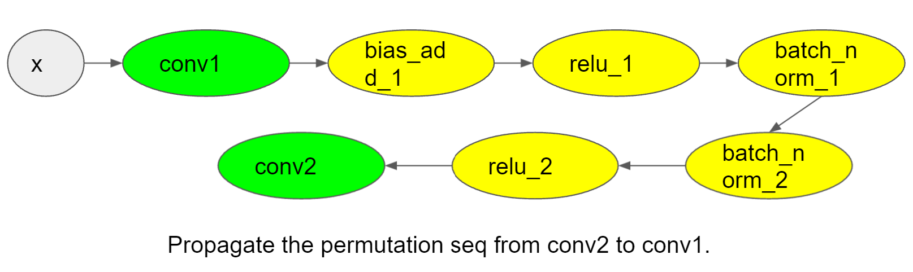
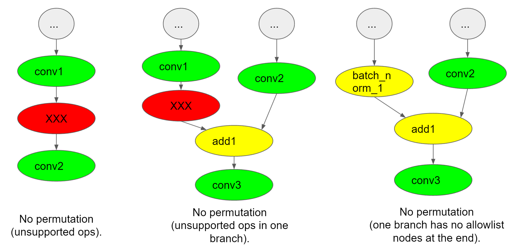

# Support structured sparsity in TF 2.x

This is a project for TF 2.x on supporting _fine-grained structured sparsity_
for the NVIDIA Ampere GPU architecture. It is an alpha implementation that has
not been extensively tested yet.

By adding a couple lines of Python code, users can sparsify a pretrained model
to benefit from faster inference speed with sparse Tensor Core operations on
NVIDIA Ampere GPUs. After that, a typical recommended recipe is to fine-tune the
sparsified model to recover the lost accuracy before the actual inference, since
the sparsification prunes about 50% of the weights from supported GEMM-based
layers (e.g., convolution or matrix multiplication). For more details about how
the sparsity works, please see the whitepaper [Accelerating Sparse Deep Neural
Networks](https://arxiv.org/abs/2104.08378).


## Usage

To compile the dependencies of the code base, users need to follow the step-0
before begining to modify their model scripts. Then, only three steps are needed
to use the TF-ASP feature.

### Step-0: Preparing Dynamic Library

The permutation option requires multiple special CUDA kernels to accelerate the
permutation sequence searching. Users need to manually compile the code
[here](./kernels/structured_sparsity.cu) as:

```bash
$ cd kernels
$ nvcc structured_sparsity.cu -Xcompiler -fPIC -shared -o structured_sparsity.so
```

Then, the `structured_sparsity.so` needs to stay in `<working_dir>/kernels`.  It
is also possible to switch to the CPU solution by `search_device='CPU'`, whereby
users might experience a terrible slowdown!


### Step-1: Importing TF-ASP

```python
import tf_asp
```

### Step-2: Initializing TF-ASP

Suppose we are using an SGD optimizer originally. Then, we need to wrap up the
optimizer and the model in the `AspOptimizerWrapperV2`. Under the hood, the
initialization marks which layers are prunable and applies weight
permutation when necessary. Note, it won't perform the actual pruning at this
moment.

Note, our design was based on the old keras optimizers, which are not migrated
to
[tf.keras.optimizers.legacy](https://www.tensorflow.org/api_docs/python/tf/keras/optimizers/legacy/Optimizer).

```python
opt = tf.keras.optimizers.legacy.SGD(learning_rate=0.2, momentum=1.0)
opt = tf_asp.AspOptimizerWrapperV2(opt, model, padding=True,
                                   plot_to_file='network.pdf')
```

### Step-3: Finetuning

Users can use training loops or Keras fit to finetune the sparsified model to
close the gap caused by the fact that about half of the weights are pruned. The
configuration and hyperparams for finetuning are same with the original training
steps. Underneath the `AspOptimizerWrapperV2`, the masks are computed and then
frozen after the first iteration. We will apply the masks to the weights after
each of the remaining train steps.


## Features and Limitations

### Pruning

* Regarding the pruning, we mainly focus on the `tf.keras.layers.Dense` and
  `tf.keras.layers.Conv2D`, since they normally involve GEMM operations on GPUs.
  They have the weights of `kernel` and `bias` but we only prune the `kernel`
  weights.
* To meet the sparse Tensor Core usage recommendation, we check whether
  the input dim of the weight matrix is divisible by 16 AND the output dim is
  divisible by 8.
  * In TF, the kernel of Dense layer stores a 2D matrix in the shape of
    (`I`, `O`). We check `I % 16 == 0 and O % 8 == 0`.
  * In TF, the kernel of Conv2D layer stores a 4D tensor in the shape of
    (`H`, `W`, `I`, `O`). But we will view it as a 2D matrix in (`I`, `H*W*O`)
    and check `I % 16 == 0 && O % 8 == 0` which guarantees
    `I % 16 == 0 && H*W*O % 8 == 0`.
* Users can set `padding=True` when initializing the `AspOptimizerWrapperV2`
  instance to allow padding over the input dim for Dense layers.

### Permutation

* Permutation is applied to eligible layers by default. The motivation of
  permutation is to better spread out the high-magnitude weights so that the
  following pruning is able to better preserve them.
* Users can turn if off by `permute=False`.
* A cool feature is introduced to generate the op graph (Note, it is op graph
  rather than layer graph.) showing how the weights are permuted and pruned in
  the model. Users can enable it by `plot_to_file=test.png`. Below are two
  example figures.

  <p align='center'>
  
  
  </p>

  * Color of the node
    * Green = permuted or pruned GEMM/CONV op.
    * Yellow = pass-through ops, passes permutation to the parents, but does
      not apply it.
    * Orange = apply-and-pass-through ops
    * Red = ops cannot handle permutations (or it is not known how to handle
      permutations for this op), so it disallows permutations for its children.
      Also, ops that are not eligible for pruning in the first place will be
      marked as red, e.g., ops are not from Keras layers, ops with incompatible
      weight dims.
  * Notation after op name
    * Integer = permutation group ID. The nodes with the same group ID are
      sibling nodes and should be permuted with the same pattern.
    * [K,C] = which dimension(s) was (/were) permuted. K is the output dim and C
      is the input dim.
    * S = whether or not the op was sparsified.

### Limitations
* TF-ASP relies on the Keras metadata to (1) check if the variables are from
  supported layers (Dense, Conv2D) and if they are prunable; (2) locate the
  variables of given ops for permutation. For (2), we do some string comparison
  between op name and layer name. Typically, the op name is in the format of
  `model_name/layer_name/op_name` which is supposed to be unique. However, since
  a valid `model_name` or `layer_name` could include an arbitrary number of `/`s
  and a model could be nested, it is possible we see "same" op_names. For
  example, we have two conv2d layers defined like below and in our op graph,
  there are two op names: `n/a/b/c/conv2d_1/Conv2D` and
  `n/a/b/c/conv2d_1/Conv2D_1`. By checking these names, it is hard to tell which
  op comes from which layer, since both match the layer names and their extended
  names. In this case the TF_ASP will skip the permutation for these ops.
  ```
  model: n
    inner_model_1: a/b
      layer_1: c/conv2d_1 (extended_layer_name=n/a/b/c/conv2d_1)
    inner_model_2: a
      layer_2: b/c/conv2d_1 (extended_layer_name=n/a/b/c/conv2d_1)
  ```
* Distributed Training with Horovod. The permutation feature introduced by
  `AspOptimizerWrapperV2` has some interactions with PRNG, meaning different
  devices might get different permutation sequences for the same variable. This
  could lead to that the different devices use different masks and thus the
  masked weights would be unmasked after data aggregation. A simple WAR is to
  conduct a broadcast after the first step of finetuning, whereby all the
  devices will share the same masks from device 0 and the masks will be
  frozen for the following steps.
### MISC.

* `AspOptimizerWrapper` is the old optimizer wrapper which is deprecated.
  `AspOptimizerWrapperV2` is the new one that supports both weight permutation
  for preserving weight magnitude and weight pruning for sparsity.
* We no longer support the `allowlist`, `denylist` parameters in the initializer
  method of `AspOptimizerWrapperV2`. This is to avoid unexpected behaviors when
  users specify arbitrary and unsupported layers. At this point, we only support
  pruning over the `Conv2D` and `Dense` layers. Also, the permutation feature
  in `AspOptimizerWrapperV2` introduces another set of allowlist, inferlist,
  skiplist, clearlist for ops. To reduce confusion, we drop the `allowlist`,
  `denylist` here. Later, only confirmed and well-tested ops or layers could be
  added to the backend.


## Appendix A. A Demo for Using TF-TRT

### Step-1: Generate a pruned model

The `main.py` will create a toy convnet model and initialize its variables with
random values. For brevity, we view it as a pretrained model and prune it via
`AspOptimizerWrapperV2`. After a couple of finetuning train steps, the model is
saved in `./exported_model`.

```bash
$ python main.py
```

### Step-2: Use TF-TRT

To ensure the inference makes use of the sparse Tensor Core, we need a special
container on NVIDIA Ampere GPUs.

```
gitlab-master.nvidia.com:5005/dl/dgx/tensorflow:tftrt_sparse
```

Then, the `tftrt_infer.py` demonstrates how to load the saved and
pruned model and turn on the sparse compute.

```bash
# Native TF
$ python tftrt_infer.py --use_native_tensorflow
# TF-TRT - Sparse compute is on by default
$ python tftrt_infer.py --use_tftrt_model
# TF-TRT - Sparse compute can be turned off
$ TF_TRT_SPARSE_MODE=0 python tftrt_infer.py --use_tftrt_model
```

Please look for `[TF-TRT] Sparse compute capability is [enabled/disabled]` in
the log to confirm whether the sparse compute is on/off. As an example, we
tested the above script on an A100 GPU and obtained the following performance
numbers. The sparse Tensor Core can give us ~16% performance gain over the
original TR-TRT inference.

```
# Native TF
  Average throughput: 350 samples/sec
# TF-TRT - With Sparse compute
  Average throughput: 1232 samples/sec
# TF-TRT - No Sparse compute
  Average throughput: 1058 samples/sec
```

## Appendix B. Permutation

### Background
Directly pruning the weights with 2:4 sparsity may zero out those weights with
high magnitude if they are clustered together for example. To resolve this
issue, we apply the permutation before pruning. The permutation can help better
spread out these high magnitude weights in the tensor.  Specifically, for a
given tensor, we permute the input dims (C-Permute), because the following
pruning is along the input dims. After the C-permute, we also need to permute
the output dims of weight tensors from previous layers (K-Permute) to match the
permuted input dims of this layer. The figures below illustrate how C-Permute
triggers corresponding K-Permute.  More info:
[video](https://www.youtube.com/watch?v=fEw2Hw013pk&t=4680s), [internal
link](https://confluence.nvidia.com/display/GCA/Permutation+Implementation+in+ASP+Library).

<div><p align='center'>


</p></div>


### Finding Good Permutation Sequence
Multiple algorithms and strategies are proposed to look for the best permutation
sequence for given weight tensors. We directly call the `Exhaustive_Search`
function provided by Jeff Pool. More info: [link](https://confluence.nvidia.com/display/GCA/Finding+a+Good+Permutation).

### Supported Graphs
To provide more general support, we categorize the supported ops as:

* _Allowlist_: the set of ops that are considered performance-critical with the
  sparse tensor cores. They are mainly GEMM-based ops, e.g., MatMul and Conv2D.
* _Inferlist_: the set of ops that require corresponding permutation when their
  downstream allowlist nodes are permuted, e.g., BiasAdd, FusedBatchNormV3.
  Note, their permutation will be made invalid if any of their upstream branches
  are not ended with allowlist ops.
* _Clearlist_: the set of ops that won't be affected by the permutation and the
  permutation sequences will be passed through to their upstream ops, e.g.,
  ReLU, AddV2, etc.
* _Skiplist_: This is a special list of ops that is mainly used in the
  plot_to_file() to make the generated graph clearer, e.g., Placeholder,
  ReadVariables, etc.

All other ops will be viewed as "unsupported" and they will break the
permutation. A typical supported graph structure is a couple of
Inferlist|Clearlist ops lying between two allowlist ops.

(1) A typical graph structure from ConvNet:

<div><p align='center'>

</p></div>

The figure shows how the permutation sequence is propagated in the graph and how
the C-Permute and K-Permute are applied among the nodes. At the beginning, the
`conv3` finds a best sequence `seq_1` and uses it for its C-Permute. Then
`seq_1` is passed upwards until other convolution ops are hit, i.e., `conv1_2`
and `conv2_1` will use `seq_1` as well for their K-Permute. During that, the
`batch_norm_2` and `batch_norm_3` get the `seq_1` and apply the K-Permute to
ensure the variables matches the permuted tensors. Following the same rule,
another `seq_2` is passed from `conv1_2` to `conv1_1`.

(2) Complex siblings:

<div><p align='center'>

</p> </div>

The above figure is adopted from
[link](https://confluence.nvidia.com/display/GCA/Permutation+Implementation+in+ASP+Library)
to show how the permutation deals with sibling nodes and it could be very
complex. As shown in the figure, `conv1_3`, `conv3_1`, `conv4_1` are viewed as
siblings because they have same allowlist parent nodes. So, we need to
concatenate their weights as one single tensor when applying the permutation
searching algorithm to make sure it is meaningful when all these nodes use the
same permutation sequence.

(3) Long chain of inferlist|clearlist operations:

<div><p align='center'>

</p> </div>

The above figure shows we need to pass the found permutation sequence from
`conv2` all the way up to `conv1`, no matter how many inferlist|clearlist
operations are between them. For those clearlist operations (normally pointwise
operations), we simply pass the sequence upstream. For inferlist operations,
like batch norm or bias add, we need to K-Permute their weights as well. In
particular, the `FusedBatchNormV3` needs to permute its gamma, beta,
moving_mean, and moving_variance weights. The `BiasAdd` needs to permute its
bias weights.


(4) Skipping permutation:

<div><p align='center'>

</p> </div>

Not all graphs are eligible for permutation even if they contain allowlist ops.
The above figures show three use cases that the permutation will be skipped.
The left case shows an unsupported operation is detected between two allowlist
ops, and this will block the permutation. The middle use case shows another
unsupported example: one branch containing unsupported operations will prevent
the permutation, even if the `conv3` does have a "good" path to `conv2`. The
right figure illustrates another case: although all the operations are
supported, the left branch has no allowlist operations at the end, meaning it is
not easy for us to make sure `batch_norm_1` will receive a correctly permuted
tensor.


