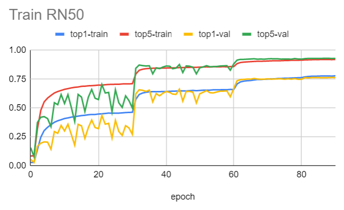

# Train ResNet50 with 2:4 Sparsity

This guidance shows an end-to-end example of how to train the ResNet50 (RN50)
model with the 2:4 structured sparsity. The main steps to obtain a sparsified
model are:

1. Train the RN50.
1. Apply permutation and pruning.
1. Finetune the RN50.

## Train the RN50
In this guidance, we use the RN50v1.5 located at
[here](https://gitlab-master.nvidia.com/dl/dgx/tensorflow/-/tree/master/nvidia-examples/cnn).
After starting the container, we first setup the environment as:

```bash
# Download and setup the ATEX sparsity.
$ cd /home/workspace
$ git clone ssh://git@gitlab-master.nvidia.com:12051/dl/tensorflow/atex.git
$ export PYTHONPATH=/home/workspace/atex:$PYTHONPATH

# Copy CUDA permutation kernels to working directory.
$ cd /workspace/nvidia-examples/cnn
$ cp -r /home/workspace/atex/kernels/ to .

# Install pydot and graphviz if the `plot_to_file` feature is used.
$ pip install pydot
$ apt update
$ apt install graphviz
```

Then, we can train the RN50 using the regular configuration.

```bash
$ mpiexec --allow-run-as-root -np 8 python -u resnet_ctl.py \
      --export_dir=/home/tmp/new_rn50_saved_model/ \
      --data_dir=/data/imagenet/train-val-tfrecord-480 --num_iter=90 \
      --iter_unit=epoch --display_every=100
```

Here we use 8 V100 GPUs and the trained model will be saved to
`/home/tmp/new_rn50_saved_model/` at the end. The following figure shows the log
collected during the training and we can see it achieves to ~75% top1 and ~92%
top5 accuracy after 90 epochs.

<div><p align='center'>

</p></div>

## Apply Permutation and Pruning

Applying permutation and pruning is very simple and we just need to wrap the
existing optimizer with `AspOptimizerWrapperV2`.

```python
opt = tf_asp.AspOptimizerWrapperV2(opt, model, padding=True,
                                   plot_to_file='resnet50.pdf')
```

Note, when the `plot_to_file` is specified, an output operation graph will be
generated to illustrate how the operations are permuted and pruned. To enable
the `plot_to_file` feature, users need to install pydot and graphviz as
instructed in the previous step.


## Finetune the RN50

The last step is to retrain or finetune the RN50, since the pruning step
generally reduces accuracy. We load the pretrained model from step 1 and conduct
the finetuning with the wrapped optimizer from step 2. This is shown in the
`enable_sparisity` branch (the non-`enable_sparsity` branch is the original
train path of step 1.):

```python
if enable_sparsity:
  import tf_asp
  assert export_dir, "--export_dir must be given."
  model = keras.models.load_model(export_dir)
  tf.get_logger().setLevel(tf_asp.SHOW_PERMUTATION_INFO)
  opt = tf_asp.AspOptimizerWrapperV2(opt, model, padding=True,
                                     plot_to_file='resnet50.pdf')

else:
  model = model_func(num_classes=image_processing.NUM_CLASSES)
```

The retrain uses the same configuration (number of epochs, hyperparams, etc.) as
the first step and the pruned model will be saved in `<export_dir>/sparse`
folder after we checked how many layers are pruned with
`tf_asp.check_pruned_model()` (which is optional).

```python
if enable_sparsity and hvd.rank() == 0:
  tf_asp.check_pruned_model(model)
  sparse_export_dir = os.path.join(export_dir, "sparse")
  model.save(sparse_export_dir)
  print(f"The model is saved to {sparse_export_dir}")
elif export_dir and hvd.rank() == 0:
  model.save(export_dir)
  print(f"The model is saved to {export_dir}")
```

Then we run the same command again but with `--enable_sparsity` to start the
retrain:
```bash
$ mpiexec --allow-run-as-root -np 8 python -u resnet_ctl.py \
      --enable_sparsity --export_dir=/home/tmp/new_rn50_saved_model/ \
      --data_dir=/data/imagenet/train-val-tfrecord-480 --num_iter=90 \
      --iter_unit=epoch --display_every=100
```

We still use 8 V100 GPUs and the pruned finetuned model will be saved to
`/home/tmp/new_rn50_saved_model/sparse` at the end. 
The following figure shows the log collected during the retraining and we can
see that the initial top1 accuraty is ~65% after the pruning but is able to
recover to ~75% after 90 epochs. The full accuracy numbers are [here](https://docs.google.com/spreadsheets/d/11C7tAJGAuVWLa6OvkJg6EUwx6ynCsOQb72aDlynTqr8/edit?usp=sharing).

<div><p align='center'>

</p></div>

Especially, from the log, we can also see how many layers got permuted and
pruned. In addition, the generated operation graph is
[here](https://gitlab-master.nvidia.com/dl/tensorflow/atex/-/blob/main/docs/pics/resnet50.pdf).
(Please download the pdf and view it on the browser to avoid unexpected
truncation).

```
[TF-ASP] 50/53 layers (Conv2D or Dense) are permuted!
[TF-ASP] 53/54 layers (Conv2D or Dense) are pruned!
```

The full code is located at
[here](https://gitlab-master.nvidia.com/dl/dgx/tensorflow/-/blob/resnet_sparsify/nvidia-examples/cnn/nvutils/runner_ctl.py).


# Infer with TF-TRT
*This part is still WIP*

Some updates:

1. We use the special container to test the TFTRT + sparsity.

```
gitlab-master.nvidia.com:5005/dl/dgx/tensorflow:tftrt_sparse
```

2. The updated TFTRT script to load the RN50 saved model is
   [here](https://gitlab-master.nvidia.com/dl/tensorflow/atex/-/blob/debugging_tftrt/tftrt_infer.py).

```bash
$ python -u tftrt_infer.py --use_native_tensorflow
# Average throughput: 4087 samples/sec

$ TF_TRT_OP_DENYLIST=Cast python -u tftrt_infer.py --use_tftrt_model
# Average throughput: 3446 samples/sec

$ TF_TRT_OP_DENYLIST=Cast python -u tftrt_infer.py --use_tftrt_model --use_sparse_compute
# Average throughput: 3568 samples/sec
```

Note, here we only see the native tensorflow inference is faster and only ~3.5%
perf gain for sparsity. This is because there are many NHWC `FusedBatchNormV3`
nodes in the graph that are not supported by the TFTRT, causing many ops not
using TFTRT engines. The log contains:

```
TensorRT unsupported/unconverted OP Report:
        - FusedBatchNormV3 -> 53x
        - NoOp -> 5x
        - Cast -> 1x
        - Identity -> 1x
        - Placeholder -> 1x
```


